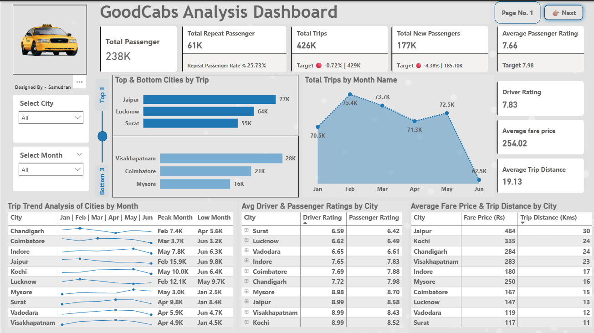

# 🚖 Goodcabs Performance Analysis – SQL, Excel & Power BI

## 🧩 Problem Statement

Goodcabs is a rising cab service provider that has carved a niche in India’s tier-2 cities. With a vision to support local drivers and ensure high-quality service to passengers, the company now operates across 10 cities and has set ambitious performance goals for 2024.

To align with these goals, the management team wanted a comprehensive analysis of key metrics, including:

- Trip volume  
- Passenger satisfaction  
- Repeat passenger rate  
- Trip distribution trends  
- New vs. repeat passenger contribution  

With the analytics manager engaged in another assignment, the responsibility was handed to Peter Pandey — a curious and detail-driven data analyst. Using tools like **SQL**, **Excel**, and **Power BI**, this project explores data-driven answers to core business questions and presents insights to help leadership make informed decisions.

---

## 🎯 Objective

The primary objective of this project is to analyze operational and passenger-related metrics for Goodcabs, a cab service company operating in tier-2 cities across India. This analysis aims to:

- Evaluate trip volume and revenue performance across cities.
- Understand the behavior and patterns of new vs. repeat passengers.
- Measure performance against monthly targets.
- Identify top and bottom performing cities based on various KPIs.
- Provide insights that will support data-driven decision-making by the Chief of Operations and other stakeholders.

The ultimate goal is to help Goodcabs optimize performance, improve customer satisfaction, and achieve their ambitious growth targets for 2024.

---

### 📈 Dashboard Overview

#### 1. Home Dashboard

The **Home Dashboard** provides a high-level overview of company-wide metrics. It includes:

- **KPI Cards** showing:
  - Total Passengers  
  - Total Repeat Passengers  
  - Total Trips  
  - Total New Passengers  

- **Bar Chart**: Highlights the **Top 3** and **Bottom 3** cities based on trip volume.

- **Tables** for:
  - **Average Fare Price & Trip Distance** by city  
  - **Average Driver & Passenger Ratings** by city  

This page helps leadership quickly grasp overall performance across key areas.

---

#### 2. Trip Analysis

The **Trip Analysis Dashboard** dives deeper into travel behaviors and city-level performance.

We begin with a visual showing the **frequency of repeat passenger trips** — uncovering how often passengers return, from 2 trips to 10 trips. This helps identify loyalty trends across cities.

Next, we have a comparison of **actual vs. target passenger ratings by city**, highlighting where service expectations are being met — and where improvements are needed.

Finally, a vibrant **ribbon chart** reveals the **demand distribution across weekdays and weekends**, segmented by city. This visualization captures shifting travel patterns and helps in planning staffing and operations accordingly.

This page unpacks the rhythm of trips and the pulse of customer satisfaction.

---

### 📊 Repeat Passenger Rate & Trip Analysis

This section focuses on understanding passenger loyalty and evaluating how well cities are meeting their trip targets.

It starts by highlighting the **Repeat Passenger Rate (%)** across cities and months, providing a clear picture of customer retention trends. The dashboard also shows **Total Passengers by Month**, helping to track overall demand patterns over time.

To assess performance, the dashboard includes a visual comparison of **Trips Against Targets by City**, showing both actual numbers and target benchmarks. Additionally, the **Trip Target Difference (%)** is shown to measure how much each city exceeded or missed its goal.

Together, these insights help identify cities with strong repeat passenger behavior and evaluate which ones are performing well operationally.

This sheet provides both strategic and operational visibility, helping stakeholders quickly identify where to double down or take corrective actions.

For a more detailed view of all visuals and metrics, refer to the full Power BI dashboard file available in the repository.

---

## 📈 Business Impact

This project provides data-backed insights that can significantly support strategic decision-making across different functional teams:

- **City-Level Strategy**: By identifying the top and bottom performing cities in terms of passenger volume and repeat rates, regional teams can focus their efforts on scaling high-potential areas and improving underperforming locations.

- **Performance Benchmarking**: The analysis comparing actual vs. target metrics (for both trips and passenger ratings) gives a clear picture of where expectations are being met and where there’s a need for intervention or new strategies.

- **Repeat Behavior Monitoring**: Repeat passenger trends broken down by frequency and city help retention teams understand customer loyalty. This can drive marketing campaigns, reward programs, and operational focus toward improving ride experience.

- **Fare Optimization**: Metrics such as average fare per kilometer and trip distance give financial insights that can guide pricing strategies and route optimization, ensuring both profitability and customer satisfaction.

- **Operational Efficiency**: Visuals like the demand variation between weekdays and weekends can assist in workforce allocation, shift planning, and overall service readiness.

Together, these insights equip decision-makers with actionable intelligence to optimize operations, improve customer satisfaction, and align team efforts toward achieving business targets.

---

---

## 📌 Conclusion

This project provided a comprehensive overview of the ride-sharing data through SQL-driven insights and interactive dashboards in Power BI. By uncovering patterns in passenger behavior, trip performance, and city-wise trends, it enables stakeholders to make data-informed decisions to optimize operations and enhance customer satisfaction.

---

---

## 🔗 Connect with Me

Thanks for checking out this project! If you found it interesting or would like to collaborate, feel free to connect:

- **LinkedIn**: [Samudran R](https://www.linkedin.com/in/samudran-r/)

